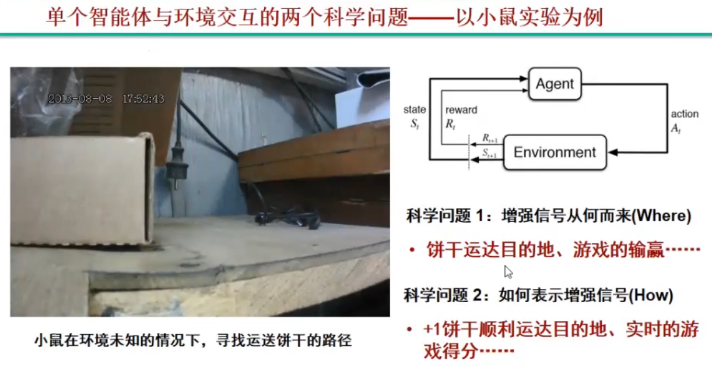

## 缘起：强化学习

在强化学习中，Agent与环境进行交互，Agent根据环境的状态`S`（上帝视角）或者观测`O`（自己的视角）做出决策，做出动作`a`，这个动作作用于环境，环境反馈一个奖励`R`，并进入下一状态`S’`。

在上述过程中，我们得到了`s,a,r,s'`。

$S_t$：环境的状态，为原始高维环境

$O_t$：从原始高维环境中提取的特征

## 崛起：深度强化学习

### 为什么是深度强化学习

1、强大的算力
使提高训练速度，处理高维原始数据，训练深度神经网络成为可能

2、深度神经网络
更好的特征表达及函数拟合能力，实现端到端学习。更深的网络层数意味着更好的学习能力（当然，网络越深也更容易过拟合，因为把噪声也学进去了）

3、特定应用环境
围棋、电子游戏等封闭、静态、确定性场景，有确定性规则

### 流派

1. 值迭代方法
   1. DQN
2. 策略迭代方法
   1. PG
   2. AC
      1. DDPG
      2. PPO

