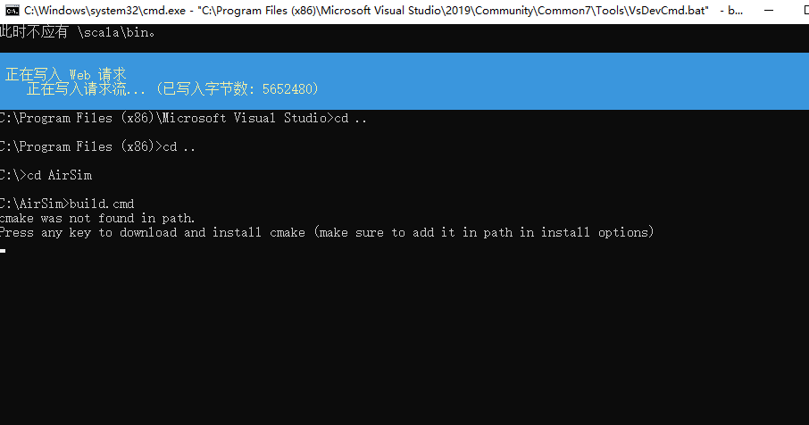
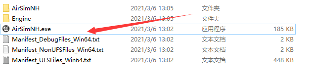
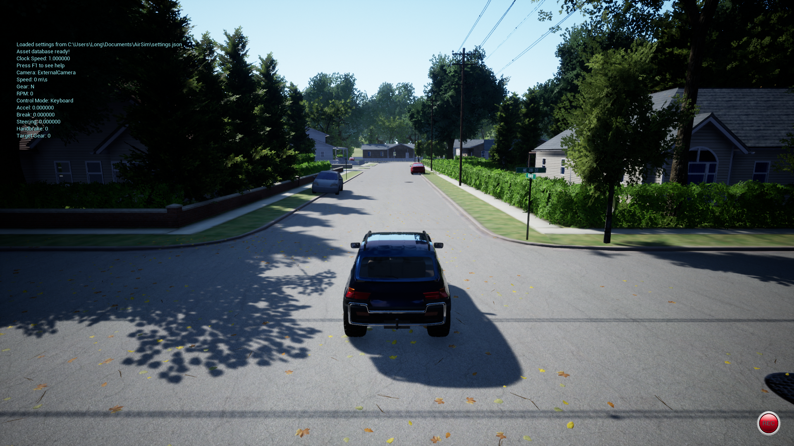
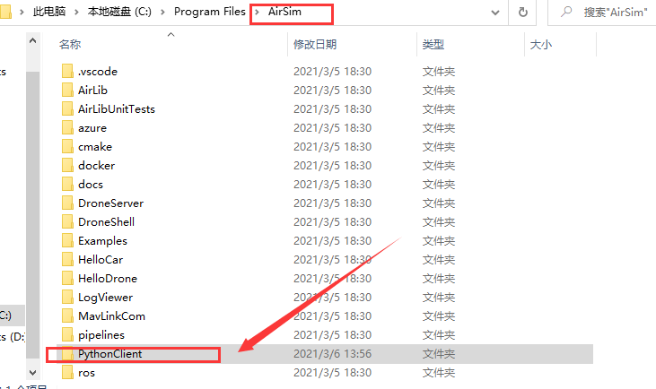
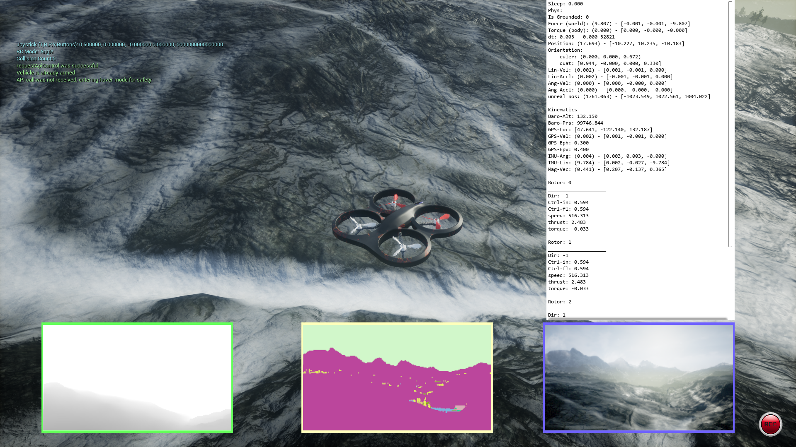

## 参考教程

1. [airsim & unreal 仿真平台](https://www.zhihu.com/column/multiUAV)
2. [安装Airsim并在Airsim仿真环境下进行DDPG DQN强化学习算法无人机训练](https://blog.csdn.net/u013166171/article/details/82997394?utm_medium=distribute.pc_relevant.none-task-blog-BlogCommendFromMachineLearnPai2-2.control&dist_request_id=&depth_1-utm_source=distribute.pc_relevant.none-task-blog-BlogCommendFromMachineLearnPai2-2.control)
3. [深度强化Q学习-基于微软AirSim仿真环境的自动驾驶案例（原理代码详解简易可行）](https://blog.csdn.net/shao918516/article/details/108106613)
4. [AirSim 仿真环境在Windows系统下的搭建（Unreal 4.24 + VS2019）](https://zhuanlan.zhihu.com/p/143574856)，解决oh oh... You need to run this command from x64 Native Tools Command Prompt for VS 2019的问题
5. [使用AirSim API 控制无人机在UnrealEngine环境的飞行](https://zhuanlan.zhihu.com/p/148192608)


## 步骤

```markdown
下载虚幻引擎

安装vs2019	https://visualstudio.microsoft.com/downloads/		选择 Desktop Development with C++

下载airsim，可以到gitee下载，速度快，如：https://gitee.com/aliensdn/AirSim?_from=gitee_search

以管理员的身份开启 Developer Command Prompt for VS 2019,

说明系统没有cmake，需要按装最新版本的cmake （https://cmake.org/download/ 选择Binary distributios）然后重新打开terminal. 这是我安装时的遇到的一个坑！！，花费了我不少时间才发现 （如果忽略这个信息，之后步骤输入build.cmd 会显示 oh oh... You need to run this command from x64 Native Tools Command Prompt for VS 2019. 然后改用x64 Native Tools Command Prompt for VS 2019也是没用的）。
```




等待一段时间


## 环境

下载环境：https://github.com/microsoft/AirSim/releases	比较大，建议科学上网下载。

```markdown
建议环境：airsimNH
		LandscapeMountains
		zhangjiajie 	-》	张家界
```






```markdown
1. 打开AirSimNH.exe
	是：车
	否：无人机
2. 在选择“是”之后，进入。
	pip install airsim
	pip install msgpack-rpc-python
	在Pycharm中运行AirSim/PythonClient/car/hello_car.py
3. API操作智能体，官方：https://github.com/Microsoft/AirSim/blob/master/docs/apis.md
	文章：https://zhuanlan.zhihu.com/p/340774859
```




## 训练无人机



AirSim/PythonClient/multirotor

非官方实现：https://github.com/AirSimDroneSimulator/AirSim/tree/master/3D_path_finding


自己实现需要知道的：

[AirSim系列(9) - 无人机相关API总结](https://zhuanlan.zhihu.com/p/340774859)

[深度强化Q学习-基于微软AirSim仿真环境的自动驾驶案例（原理代码详解简易可行）](https://blog.csdn.net/shao918516/article/details/108106613)——推荐


## 多智能体

官方文档：https://microsoft.github.io/AirSim/multi_vehicle/#creating-multiple-vehicles

找到settings.json文件并按照上面文档修改，打开环境后会发现变为2个无人机。

我的settings.json在`C:\Users\Long\Documents\AirSim`

```
{
    "SettingsVersion": 1.2,
    "SimMode": "Multirotor",

    "Vehicles": {
        "Drone1": {
          "VehicleType": "SimpleFlight",
          "X": 4, "Y": 0, "Z": -2,
      "Yaw": -180
        },
        "Drone2": {
          "VehicleType": "SimpleFlight",
          "X": 8, "Y": 0, "Z": -2
        }

    }
}
```

设置更多个


